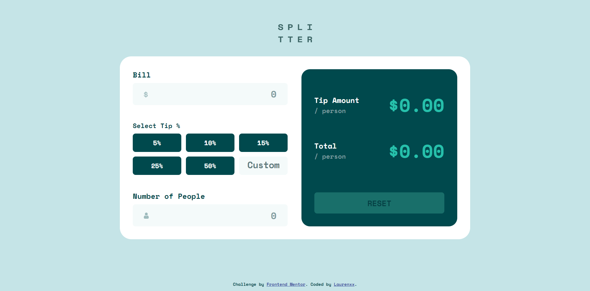

# Frontend Mentor - Tip calculator app solution

This is a solution to the [Tip calculator app challenge on Frontend Mentor](https://www.frontendmentor.io/challenges/tip-calculator-app-ugJNGbJUX). Frontend Mentor challenges help you improve your coding skills by building realistic projects.

## Table of contents

- [Overview](#overview)
  - [The challenge](#the-challenge)
  - [Screenshot](#screenshot)
  - [Links](#links)
- [My process](#my-process)
  - [Built with](#built-with)
  - [What I learned](#what-i-learned)
  - [Continued development](#continued-development)
- [Author](#author)

## Overview

### The challenge

Users should be able to:

- View the optimal layout for the app depending on their device's screen size
- See hover states for all interactive elements on the page
- Calculate the correct tip and total cost of the bill per person

### Screenshot




### Links

- Solution URL: [https://github.com/awsmPuff/tip-calculator-app](https://github.com/awsmPuff/tip-calculator-app)
- Live Site URL: [https://awsmpuff.github.io/tip-calculator-app/](https://awsmpuff.github.io/tip-calculator-app/)

## My process

### Built with

- Semantic HTML5 markup
- CSS custom properties
- Flexbox
- CSS Grid

### What I learned

Use this section to recap over some of your major learnings while working through this project. Writing these out and providing code samples of areas you want to highlight is a great way to reinforce your own knowledge.

To see how you can add code snippets, see below:

```js
//Access Clicked Element From an Array With the Same Class
var allActionButtons = document.getElementsByClassName("action-buttons");

var functionToRunWhenClicked = function {
  // Add some stuff here
}

for (var i = 0; i < allActionButtons.length; i++) {

  allActionButtons[i].addEventListener('click', functionToRunWhenClicked, false);

}

```

### Continued development

- Change the order of Select tips and Number of people.


## Author

- Website - [Wanxia Xie/Laurenxx](https://www.your-site.com)
- Frontend Mentor - [@awsmPuff](https://www.frontendmentor.io/profile/awsmPuff)

